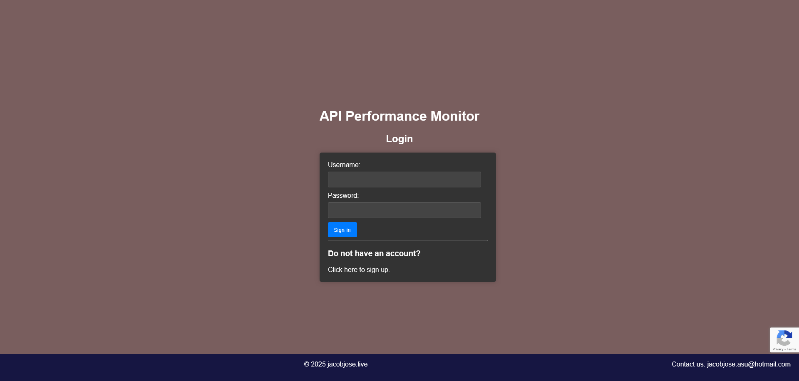

# API Performance Monitor (APM)

[ApiPerformanceMonitor.onrender.com](https://apiperformancemonitor.onrender.com)

## About
APM is a centralized log monitoring tool that can be pinged from other applications.

## Architecture
[Click here](miscellaneous/documents/APM-Design_Document.pdf) for the project architecture.  

## Running the APM Locally
### Prerequisites
1. [Java Development Kit (JDK)](https://www.oracle.com/java/technologies/downloads/)
2. [Apache Maven](https://maven.apache.org/download.cgi)
2. [MongoDB Server](https://www.mongodb.com/try/download/community)

#### Docker
You can also run the project by building and running the Dockerfile. Your computer must have [Docker](https://www.docker.com/products/docker-desktop/) installed for this.  

### Steps to execute using JDK + MongoDB
1. Update MongoDB configuration information in the  `application.yaml` (_backend/src/main/resources/application.yaml_).
2. Go to **backend** folder inside the root directory.
3. Open Terminal inside the backend directory.
4. Do the Maven build using the command: `mvn clean install`.
5. Go to the target folder: `cd target`
6. Run the JAR file: `java -jar .\apm-0.0.1-SNAPSHOT.jar`
7. Access Project at [http://localhost:8080/login](http://localhost:8080/login).

### Steps to execute using Dockerfile + MongoDB
1. Update MongoDB configuration information in the  `application.yaml` (_backend/src/main/resources/application.yaml_).
2. Open Terminal in the root directory. 
3. Run the project via the Dockerfile on the **port 8080**.
4. `docker build -t apm_image:latest .`
5. `docker run -p 8080:8080 --name apm_container apm_image:latest`
6. Access Project at [http://localhost:8080/login](http://localhost:8080/login).